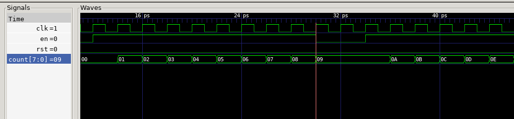
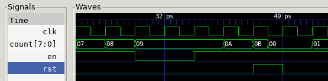

# Task 1

## Intro to System Verilog and Verilator

We were tasked to explore System Verilog and testbench using Verilator for this task. The files formed were [counter.sv](counter.sv) and [counter_tb.cpp](counter_tb.cpp) resulting in these [waveforms](counter.vcd).

## Test Yourself Challenges

### Modify the testbench so that you stop counting for 3 cycles once the counter reaches 0x9, and then resume counting.  You may also need to change the stimulus for _rst_.
---

The _en_ variable needs to change to 0 between 0x9 and 0x11. The _rst_ config where reset triggers at i=15 needs to be removed.

```cpp
top->rst = (i<2); // remove i=15
top->en = ((i>4) && (i<(4+9+1))) | (i>(4+9+2)); // change en trigger timing
```

The resulting waveform:


There is a 3 clock-cycle delay after counter reaches 0x9.

### The current counter has a synchronous reset. To implement asynchronous reset, you can change line 11 of counter.sv to detect change in _rst_ signal.  (See notes.)
---

The _always\_ff_ block needs to take into account the low-to-high edge of _rst_.

```verilog
module counter #(
    parameter WIDTH = 8
) (
    input   logic               clk, // clock
    input   logic               rst, // reset
    input   logic               en, // counter enable
    output  logic [WIDTH-1:0]   count // count output
);

always_ff @( posedge clk, posedge rst)
    if (rst)    count <= {WIDTH{1'b0}};
    else        count <= count + {{WIDTH-1{1'b0}}, en};
    
endmodule
```

The resulting waveform:


The counter changes to x0 before the next clock's rising edge.