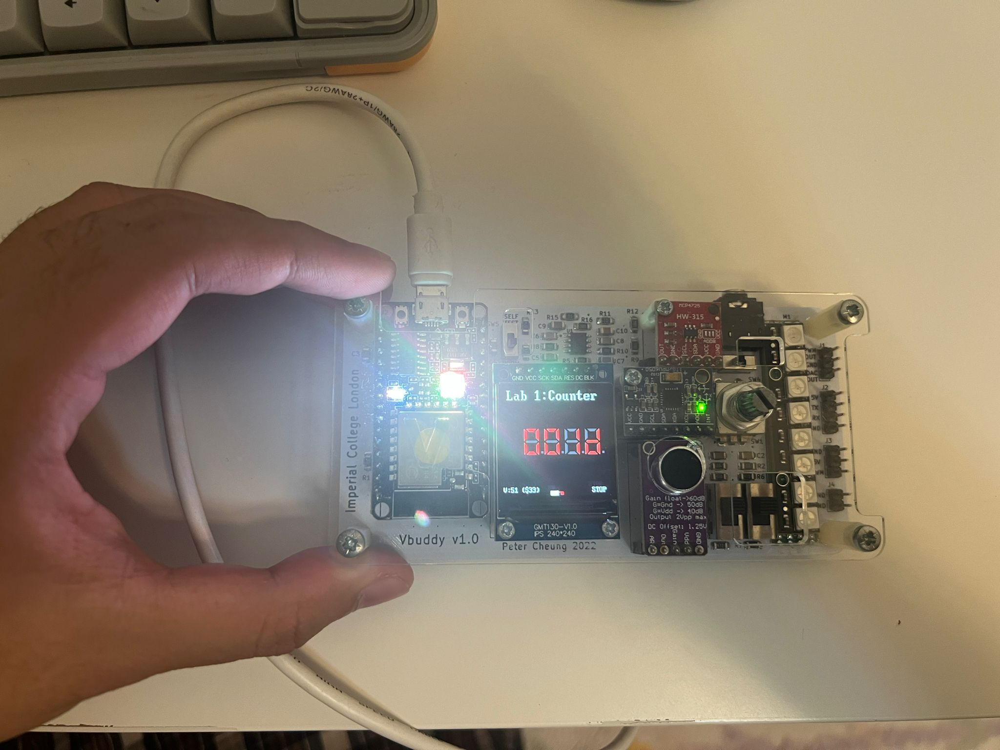
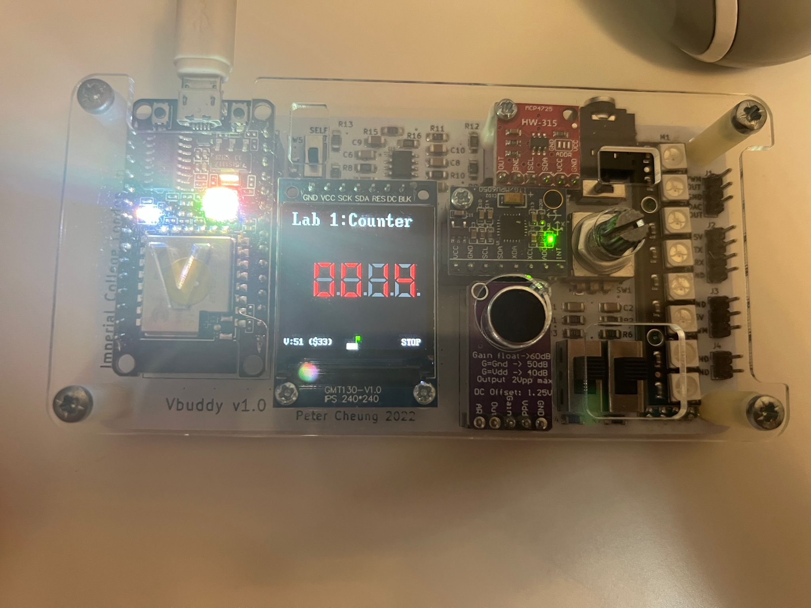
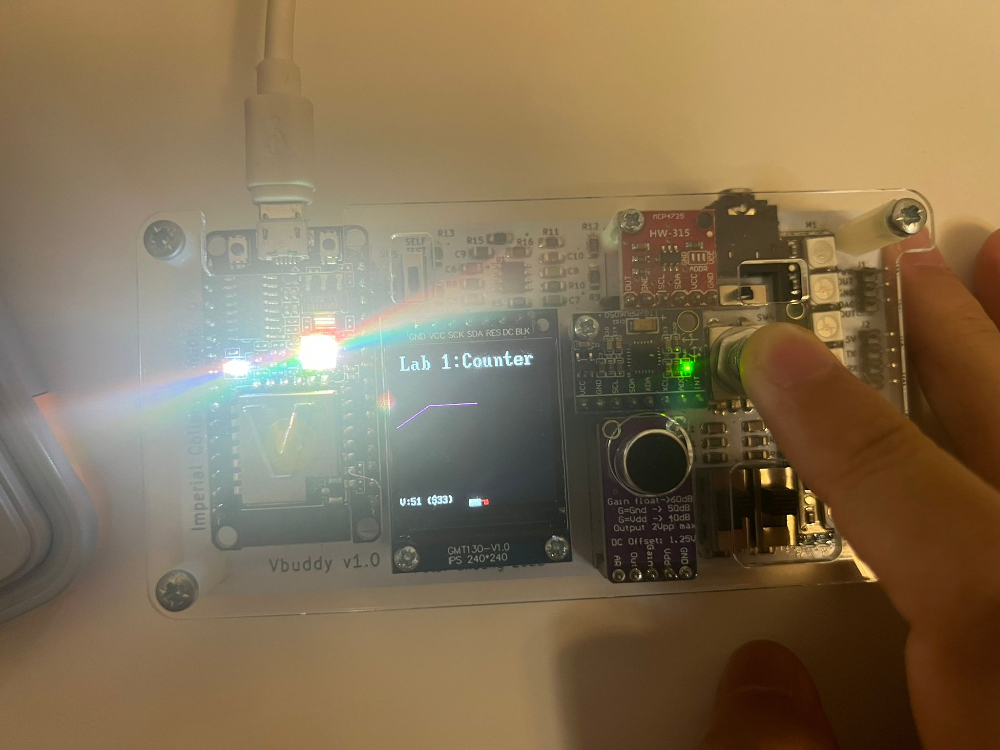
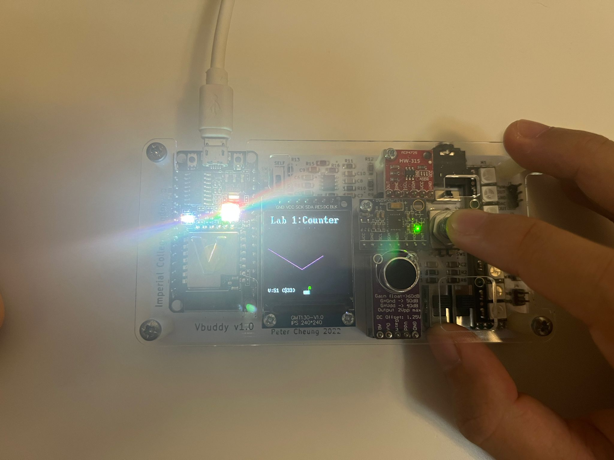

# Task 2: Linking Verilator simulation with Vbuddy

## First Steps

The steps in the Lab 1 document was followed and it lit up, indicating it was on.



I modified the _count\_tb.cpp_ and _counter.sv_ files to link with Vbuddy, created _vbuddy.cfg_ and recompiled.

To ease the compiling and linking, I edited the _doit.sh_ file:

```sh
#connect Vbuddy to WSL
~/Documents/iac/lab0-devtools/tools/attach_usb.sh

#config vbuddy.cfg
ls /dev/ttyU* > vbuddy.cfg
```

Vbuddy ran as expected and visualised the counter.

## Exploring the Flag Feature

After following the steps to enable and disable the counter using the switch and recompiliing, this is what is seen on Vbuddy.



The small green symbol on the bottom is the internal flag. The counter counts up at the start. When the rotary encoder is pressed, the flag toggles between green and red. It also toggles between starting and stopping the counter.

The testbench file can also be edited to plot the counter values. After following the steps, this is what is seen on Vbuddy.



## Test Yourself

### Modify your counter and testbench files so that the **_en_** signal controls the direction of counting: ‘1’ for up and ‘0’ for down, via the **_vbdFlag()_** function.

The _counter.sv_ file's logic needs to be edited to allow counting up and down based on the _en_ variable state.

```verilog
module counter #(
    parameter WIDTH = 8
) (
    input   logic               clk, // clock
    input   logic               rst, // reset
    input   logic               en, // counter enable
    output  logic [WIDTH-1:0]   count // count output
);

always_ff @( posedge clk, posedge rst)
    if (rst)    count <= {WIDTH{1'b0}};
    else begin
        if (en) count <= count + {{WIDTH-1{1'b0}}, 1'b1};
        else count <= count - {{WIDTH-1{1'b0}}, 1'b1};
    end
    
endmodule
```

During testing, Vbuddy performed as expected, producing a plot that can go up or down depending on the internal flag's state.

